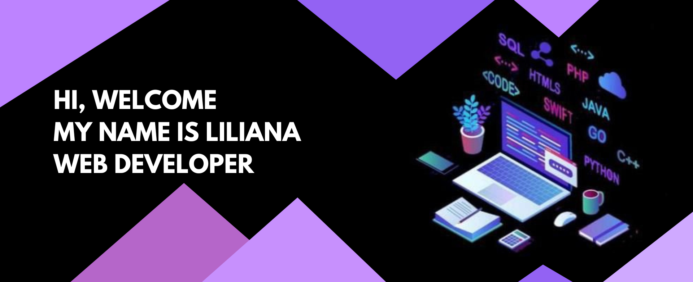

#  Bienvenid@ al GitHub de liliAguilarS 

 

📍 Who am I?

I am a developer with experience in building web applications. I enjoy solving complex problems with clean, efficient, and well-documented code.

📬 Let’s connect!

◆ I collaborate effectively and share ideas to create better solutions.                        
◆ I’m constantly learning new technologies.    
◆ I pay attention to detail in design and user experience.

If you’re interested in my profile, feel free to contact me via email or LinkedIn.                                      

# Technologies 💻

<!--

**liliAguilarS/liliAguilarS** is a ✨ _special_ ✨ repository because its `README.md` (this file) appears on your GitHub profile.

Here are some ideas to get you started:

- 🔭 I’m currently working on ...
- 🌱 I’m currently learning ...
- 👯 I’m looking to collaborate on ...
- 🤔 I’m looking for help with ...
- 💬 Ask me about ...
- 📫 How to reach me: ...
- 😄 Pronouns: ...
- ⚡ Fun fact: ...
-->
